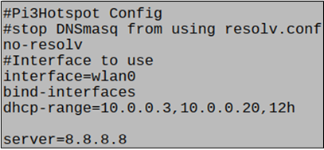

# 가정 전력 관리 IOT

머신러닝 기반 가전 전자기기 패턴 분석 및 소비 전력 예측, 가정 전력 관리 IOT <br>
한이음 공모전 링크[시연 영상](https://youtu.be/92LiChUQlh4)

INDEX
------------------------------------------------
> #### **Ⅰ. Project desgin part**
>
> **1. 프로젝트 개요** 
> - 프로젝트 소개 
> - 추진 배경 및 필요성
> - 국내 외 기술 현황 
> - 개발 목표 및 구성도
>
> **2. 기대 효과 및 활용 분야** 

<br>

> #### **Ⅱ. Internal technology part**
>
> **1. Smart tap**
> - Sensor & parts
> - How to send data
>
> **2. Energier**
> - Sensor & parts
> - How to send data
>
> **3. Andorid application**
> - Menu & UI & 기능
> - Pushy 알림
>
> **4. Server**
> - Development environment & technology
> - Grafana ( monitoring Service )
>
> **5. Machine learning**
> - Random forest algorithm
> - K-means-clutering algorithm
> - DTW algorithm

<br>


Ⅰ. Project desgin part
----------------------

### 1. 프로젝트 개요
#### (1) 프로젝트 설명 
딥러닝 기반으로 가정의 총 소비전력과 가전 제품의 개별 소비전력을 측정 및 분석 관리해주는 시스템<br>

#### (2) 기획의도
1. 누진세 방지
2. 대기전력 차단
3. 전기 사용량 예측 및 분석<br>

#### (3) 작품 내용
본 프로젝트는 가정에서 사용되어지는 전력을 절약하기 위한 목표를 가지며, 크게 네 가지로 나누어 볼 수 있다.
1. 개별 전력 측정 기기인 스마트 멀티탭
2. 전체 전력 측정 기기이며  우리 제품은 Energier로 불림
3. Android application
4. 모니터링 서비스<br>

#### (4) 시스템 구성도
<br>
#### (5) 기능 구성도
<br>
#### (6) 하드웨어 구성도
##### ⊙ Energier
<br>
<br>
##### ⊙ 스마트 멀티탭
<br>
<br>

### 2. 기대 효과 및 활용 분야
1. 전기 수요 예측 및 패턴 분석 -> 전기 요금 절약 및 화제 예방
2. 전자기기 패턴 분석 –> 개별적으로 많이 사용하는 제품 인지
3. Smart home infra -> 수요관리사업자로서 수요자원거래시장 참여

<br>

Ⅱ. Internal technology part
---------------------------

#### 1. Smart tap
Smart tap은 소위 스마트 멀티탭이라 불리는 기기이다. 본 프로젝트에서는 가정에서 사용되어지는 개별 전력들을 측정하기위한 기기이다.<br>
#### (1) Sensor & parts
##### ⊙ 사용 모듈 - Raspberry Pi 3 B+
<br><br>
##### ① 전류 측정 센서 - ASC 712
 <br>
 - 전류를 측정하기 위한 센서로, 출력이 아날로그 값이기 때문에 ADC(Analog-to-Digital Converter)를 이용하여 값을 구했다.<br>
 
 ***ⅰ)*** 계산은 True RMS 전류를 구하는 방식인 `제곱 평균 제곱근을` 이용했다. 그리고 다음은 1초 동안의 전류를 측정하기 위한 코드이다.
 ``` python
 def getIrms(PIN) :
   count = 0
   rms = 0
   I_in = 0
   sigma_I = 0

   start_time = time.time()
   while True :
     I_in = (mcp.read_adc(PIN) * (2.0/41.0)) - 24.97561
     sigma_I += I_in * I_in
     count += 1

     if(time.time() - start_time) > 1 :
       break
       
   rms = math.sprt(sigma_I / count)
   return rms
 ```
 <br>
 
 ***ⅱ)*** 전류 측정은 콘센트가 연결된 순간부터 계속 진행되어야 하기에 위 동작을 반복한다. 1초마다 1구씩, 총 4개의 구를 돌아가면서 전류를 측정한다.
 ``` python
def MeasureCurrent() :
  ...
  
  for cnt in range(len(CURRENTPIN)) :
    CURRENT[cnt] += getIrms[CURRENTPIN[cnt]]
  
  ...
 ```
<br><br>

#### ② 릴레이 모듈
 <br>
- 릴레이 모듈을 이용하여 스마트 멀티탭을 원격제어 할 수 있게 된다. 사용법은 NO 단자와 NC 단자 중 어디에 전선을 연결하는지에 따라 프로세서가 주는 신호 중 HIGH에 켜지거나 LOW에 켜지는 것을 결정할 수 있다.<br>
 
 ***ⅰ)*** 안드로이드 어플로부터 원격 제어 신호가 들어오면 그 신호에 따라서 릴레이 모듈이 전원 ON/OFF를 제어하게 된다.
 ``` python
 if 'on' in message :
   GPIO.output(RELAY[0], TRUE)
   print("ON")
 elif 'off' in message :
   GPIO.output(RELAY[0], FALSE)
   print("OFF")  
 ```
<br><br>
 
#### ③ Push button
 Push button은 스마트 멀티탭을 처음 이용시에 wifi 설정에 사용되어진다. 
<br><br>

#### ④ LCD
 LCD는 스마트 멀티탭에서 wifi 연결 여부, 현재 사용중인 전력값 등 간단한 정보를 표시하기 위함이다.
<br><br>

#### ⑤ Analog-to-Digital converter
 전류 측정을 할 때 라즈베리파이를 이용해 ACS-712에서 값을 추출하는데, 이 때 아날로그 신호를 디지털 신호로 변경하기 위해 사용한다.
<br><br>

#### ⑥ 배치도
<br>
***ⅰ)*** 각 모듈들과 라즈베리파이에 전원을 공급하기 위한 변압기를 추가시킨다.<br>
***ⅱ)*** 메인이 되는 선의 (+)를 릴레이 모듈로 먼저 들어가게 한다. 이는 릴레이 모듈이 열렸는데도 스위치에서는 닫힘 판정을 받는 것을 방지하기 위함이다.<br>
***ⅲ)*** 릴레이 모듈을 통과한 (+)선은 스위치를 거쳐서 멀티탭 구에 들어간다.<br>
***ⅳ)*** 메인이 되는 선의 (-)는 스위치로 먼저 들어가게 한다. 스위치를 통과한 (-)는 ACS-712로 들어가서 전류 측정에 사용된다.<br>
***ⅴ)*** 각 구는 GND 단자와 연결한다.
<br><br>

### (2) How to send data
#### ① WIFI AP 모드
우리 프로젝트에서는 특정 프로토콜을 이용하여 전체적인 데이터를 주고 받기 위해서 wifi 연결을 지향한다. Raspberry pi 3 보드의 경우 BCM43438 무선랜 칩을 사용하며 이는 AP모드를 지원한다. 먼저 hostapd와 dnsmasq 패키지를 설치한다. hostapd는 AP모드로 사용하기 위해 필요하며 dnsmasq는 DHCP, DNS설정시 이용한다.
<br>


- 와이파이 이름은 `ssid = Why-pi` 비밀번호는 `wpa_passphrase = Raspberry`으로
와이파이 암호화 방식은 `wpa_pairwise = TKIP`, `rsn_pairwise = CCMP` 으로 구성되어 있다.
<br>


- 앞서 설정한 hostapd.conf를 hostapd 구성의 절대 경로로 사용하기 위한 수정이다.
<br>


- DNS Forward로서 Remote DNS에 쿼리를 날릴 경우 생길 수 있는 문제점을 줄여주기 위한 중간 역할을 한다.
- DHCP Server 역할을 하여, 홈 네트워크에 구성에 있어서 장점으로 작용한다.
<br>


- 마지막으로 위 사진의 마지막줄을 주석처리 해줌으로써 재부팅 이후 라즈베리파이를 AP모드로 열 수 있게 된다.
<br>

프로그램 내부 실행 순서는 다음과 같다.<br>
<br>

***ⅰ)*** 동작 모드<br>
프로그램의 동작 모드는 디렉토리 내의 `동작 구분 파일`로 진행된다.
``` python
def InterruptButton():
LCDclear()
	LCD('Wifi setting', 1)
	LCD('Initializing...', 2)
	sleep(3)

	print('InterruptButton()')
	f = open('/home/pi/project/0515/operation.txt', 'w')
	f.write('1')
	f.close()

	print('SaveNetInfo()')
	f = open('/etc/wpa_supplicant/wpa_supplicant.conf', 'w')
	f.write('ctrl_interface=DIR=/var/run/wpa_supplicant GROUP=netdev\n')
	f.write('update_config=1\n')
	f.write('country=US\n')
	f.close()

	LCDclear()
	LCD('   System will  ', 1)
	LCD('     Reboot     ', 2)

	os.system(OS_REBOOT)
  
```
- 최초 1회 실행 시 그 ‘동작 구분 파일’이 없기 때문에 새 파일을 생성해준다. 처음 실행했기 때문에 와이파이 연결도 안 되어 있고 이에 따라 통신은 하지 않는다.
- 버튼으로 인터럽트와 같은 입력을 주면 내부 통신 설정을 변경하고 `동작 구분 파일`을 `통신 모드`로 설정하여 재부팅 후 AP모드로 열리게 된다.
<br>

***ⅱ)*** 통신 모드<br>
프로그램 실행 시 `동작 구분 파일`이 `통신 모드`인 경우 진행한다. AP모드로 열리며 이에 따라 인터넷 망으로의 접속은 불가능하다.
```python
def APopen():
	print('APopen()')
	LCDclear()
	LCD('WIFI SET', 1)
	LCD('Check Mobile App', 2)

	TCP_IP = 'xx.xx.x.x'
	TCP_PORT = 8000
	BUFFER_SIZE = 1024

	s=socket.socket(socket.AF_INET, socket.SOCK_STREAM)
	s.setsockopt(socket.SOL_SOCKET, socket.SO_REUSEADDR, 1)
	s.bind((TCP_IP, TCP_PORT))
	print('listen...')
	s.listen(1)

	conn, addr = s.accept()
	print('connection address:', addr)
	data = conn.recv(BUFFER_SIZE)
	print("recevied data :", data)
	spdata1 = data.split('@')
	spdata2 = spdata1[1].split('#')
	SSID = str(spdata1[0])
	PW = str(spdata2[0])
	print('SSID :', SSID, 'PW :', PW)
	conn.close()

	SaveNetInfo(SSID, PW)

	f = open('/*/**/***/****/operation.txt', 'w')
	f.write('2')
	f.close()

	LCDclear()
	LCD('Wifi Seting', 1)
	LCD('Finished.', 2)
	sleep(3)
	LCDclear()
	LCD('   System will  ', 1)
	LCD('     Reboot     ', 2)
```
- TCP 서버를 열어서 listen 상태로 모바일 앱의 접속을 기다린다. (모바일 어플을 통해 wifi setting을 하기 때문이다)
- 어플로부터 가정에서 사용중인 공유기의 SSID, PW를 수신받는다.
- 서버를 닫고 수신된 정보로 네트워크 conf 파일을 수정한다. 즉, `동작 구분 파일`을 `전체 모드`로 변경하여 재부팅한다.
<br>

***ⅲ)*** 전체 모드<br>
프로그램 실행 시 `동장 구분 파일`이 `전체 모드`인 경우 진행한다. 인터넷 망과 연결이 되어있기 때문에 각종 통신이 가능하다.
``` python
if(operation_cnt == 2):
	LCDclear()
	LCD('mode : 2', 1)
	sleep(1)

	LCDclear()
	LCD('Init Multitab', 1)
	InitGPIO()
	InitRelay()
	InitButton()

	LCDclear()
	LCD('Checking Network', 1)
	LCD('   Connection', 2)
	IsNetwork()

	# Open database connection
	LCDclear()
	LCD('Database set...', 1)
	for i in range(3):
		try:
			conn_sql = pymysql.connect(
			host = "itemdbinstance.cjope8aj62hv.ap-northeast-2.rds.amazonaws.com",
			user = "junhok82",
			password = "item1234",
			db = 'item_rds',
			charset = 'utf8mb4',
			autocommit = True, cursorclass=pymysql.cursors.DictCursor)
		except:
			print('Database Err')
			LCDclear()
			LCD('Database !!', 1)
		else:
			IsDB = True
			break

	LCDclear()
	LCD('Threading...', 1)
	thread_mqtt = threading.Thread(target=InitMQTT)
	thread_mqtt.daemon = True
	thread_mqtt.start()

	LCD('Process Starts!!', 1)
	CorrectADC()
	while True:
		MeasureCurrent()
		LCDclear()
		LCD(str("1:"+"%0.2f" % CURRENT[0] + "  " + "2:"+"%0.2f" % CURRENT[1]), 1)
		LCD(str("3:"+"%0.2f" % CURRENT[2] + "  " + "4:"+"%0.2f" % CURRENT[3]), 2)
```
- 데이터베이스에 접속하는 연결을 초기화한다.
- 전원 제어를 위한 MQTT 프로토콜을 멀티 스레드로 실행시킨다.
- MeasureCurrent() 함수로 전류를 측정하여 LCD에 해당 내용을 출력시킨다.
<br><br>

#### ② MQTT 통신
전력 데이터를 송수신 하기 위한 가벼운 메세징 프로토콜이다. 여기서는 특정 topic에 대해 부합하면 callback하는 역할을 하고 있다. 다음의 예시는 item/control 이라는 topic을 통해 제어신호를 받는다.
<br>
``` python
# when client connect to server, do callback
def on_connect(client, userdata, flags, rc) :
  client.subscribe("item/control")
  
# when client received message
def on_message(client, userdata, msg) :
  message = str(msg.payload).split("'")
  
  ...
  
  client = mqtt.Client("name1")
  client.on_connect = on_connect
  client.on_message = on_message
  client.connect("xx.xxx.xx.xxx",1883)
```
- 객체를 생성하여 연결된 IP에 해당 PORT를 통해 데이터를 주고 받는다.
<br><br>

### 2. Energier
Energier는 가정 내에서 사용되어지는 전체 전력을 측정하기 위한 기기이다.<br>
### (1) Sensor & parts
#### ⊙ 사용 모듈 - Arduino nano & Nodemcu
 <br><br>
#### ① 전류 측정 센서 - SCT-013-000
CT센서와 EmonLib를 사용하여 설계를 진행했으며 설계 방법은 아래와 같다.<br>

<br>

CT센서를 통해 전류를 측정하기 위해서는 Burden 저항값과 계산값이 필요하다. 아래 세가지 식을 이용해서 이상적인 burden 저항값을 구할 수 있다.<br>
***ⅰ)*** Primary peak-current = RMS current × √2 = 100 A × 1.414 = 141.4A<br>
***ⅱ)*** Secondary peak-current = Primary peak-current / no. of turns = 141.4 A / 2000 = 0.0707A<br>
***ⅲ)*** Ideal burden resistance = (AREF/2) / Secondary peak-current = 2.5 V / 0.0707 A = 35.4 Ω
<br>
이상적인 Burden저항의 값은 35.4 Ω이지만 해당값을 구하기 위해서는 저항을 합성하는 과정이 필요하고, 본 설계에서는 3가지 저항을 합성해 36 Ω을 제작하여 사용했다.
<br><br>

#### ② 전압 측정 - ZMPT101B
<br>
전압측정은 유효 전력을 구하기 위한 순시전압을 얻을 때 사용한다. 구해진 순시전압은 순시전류와 곱해서 유효전력이라 부른다.
<br><br>

#### ③ 전류 및 전압 측정 회로 구성
<br>
<br><br>

#### ④ 전체 구성도
<br>
케이스에는 하나의 출입구가 있어 전류와 전압을 측정하기 위한 각각의 케이블이 같은 출입구를 사용한다. 또한 모듈은 아두이노를 사용하며 통신을위한 nodemcu가 추가적으로 사용된다. 이는 뒤에 부연설명을 하겠다.
<br>

### (2) How to send data
#### ① 통신 메커니즘
<br>
- 서버에 전류, 전압, 전력, 요금 등 데이터를 송신하기 위한 메커니즘이다.
- 센서로부터 sensing 되어진 데이터를 아두이노 나노의 UART 통신을 통해 nodemcu로 전달된다.
- NodeMCU에 부착된 esp8266을 이용하여 wifi 연결을 한다.
- MQTT 통신을 통해 nodemcu에 저장된 데이터들을 서버로 전송한다.
<br><br>

#### ② URAT 연결 - Arduino nano 
Arduino nano의 Rx-Tx를 이용하여 UART 통신을 한다.
```c
SoftwareSerial sw(2, 3); // RX, TX vbgb   

void setup() {
 Serial.begin(115200);
 Serial.println("Interfacfing arduino with nodemcu");

 ...
 
```
<br>

#### ③ Wifi 연결 - Nodemcu
Nodemcu에 소장된 esp8266을 이용하여 wifi에 연결한다.
``` c
#include <ESP8266WiFi.h>                                         // esp8266을 이용한 wifi 연결

void setup_wifi() {
    delay(10);
    // We start by connecting to a WiFi network

    WiFi.begin(ssid, password);                                  // wifi 연결 시도

    while (WiFi.status() != WL_CONNECTED) {                      // wifi 연결확인
      delay(500);
      Serial.print(".");
    }
```
<br><br>

#### ③ MQTT 통신
스마트 멀티탭과 마찬가지로 데이터들을 송수신 하기 위한 가벼운 메세징 프로토콜이다. 차이점이 있다면 언어의 차이점이 있다.
``` c
while (!client.connected()) {                                          // Client로서 서버에 mqtt 연결
    Serial.print("Attempting MQTT connection...");
    client.publish("outTopic", "hello world");
                                                                       // Create a random client ID
    String clientId = "NodeMCUClient-";
    clientId += String(random(0xffff), HEX);
                                                                       // Attempt to connect
    if (client.connect(clientId.c_str(),MQTT_USER,MQTT_PASSWORD)) {
      Serial.println("connected");
                                                                       //Once connected, publish an announcement...
      client.publish("/ic/presence/nm/", "hello world");
    } else {
      Serial.print("failed, rc=");
      Serial.print(client.state());
      Serial.println(" try again in 5 seconds");
                                                                       // Wait 5 seconds before retrying
      delay(5000);
    }
  }

```
<br><br>

### 3. Andorid application
#### ① Menu & UI & 기능
***ⅰ)*** 초기 화면 메뉴<br>
<br>

***ⅱ)*** 이용량 조회<br>
<br>

***ⅲ)*** 원격 제어<br>
<br>

***ⅳ)*** 전력 예측<br>
<br>

***ⅴ)*** 기기 연결<br>
<br>
<br>

#### ② Pushy 알림
(2) Pushy 알림 - 동작과정 <br>
어플리케이션에서 목표치 설정 후 요구조건 만족 시 알람이 오도록 하는 오픈 소스이다.<br>
<br>

***ⅰ)*** 목표치 설정<br>
<br>
- 안드로이드 어플리케이션을 통해 목표설정 메뉴를 들어가게 되면 목표설정을 할 수 있는 입력칸을 볼 수 있다.
- 입력칸에 원하는 목표전력을 입력하면 설정값이 어플리케이션 내에 적용될 뿐만 아니라 서버에 저장된다.<br>

***ⅱ)*** 전력 데이터 수신<br>
- 전력 데이터가 앞서 설명 했다싶이 Mqtt 통신을 통해 모듈로부터 서버로 전송된다.<br>

***ⅲ)*** 전력 데이터 읽기<br> 
- RDS의 DB를 열람하면 전력 데이터들이 테이블에 담겨져있는 것을 확인 할 수 있다.<br>

***ⅳ)*** 설정 목표치와 누적 전력 사용량 비교<br>
``` python
if watt_setting !=0 and db_id > cnt :         // 설정 목표치가 있고 측정된 전력데이터가 있을 때
  watt_leave = watt_setting * float(msg[1])

/**** 목표 요구 조건 달성 시 해당 메세지를 보냄 ****/
  try :           
    if(2 * watt_setting / 10) < watt_leave <= (3 * watt_setting / 10) :
      data = {'message' : '목표전력 70% 사용'}    
    elif(watt_setting / 10) < watt_leave <= (2 * watt_setting / 10) :
      data = {'message' : '목표전력 80% 사용'}
    
    ...
    
```
***ⅴ)*** 푸쉬 알림 동작 확인<br>
<br>
- 목표 전력량의 70% 80% 90% 100%에 도달할 경우 오른쪽처럼 푸시알림이 도착하는 것을 확인할 수 있다.<br>
<br>
      

### 4. Server
#### ① Server - Ec2
Amazon EC2를 서버로 활용하고 있다. 다음 표는 서버에서 수행중인 내용이다.<br>
 <br>

#### ② Database - RDS
데이터베이스로 Amazon RDS에 MySQL을 활용하고 있다. 다음 표는 데이터베이스 구성 내용이다.<br>
<br>

### 5. Machine learning
#### ① 머신러닝을 이용한 전기 사용량 예측
- Random Forest Regression 기반의 머신러닝
- 훈련 과정에서 구성한 다수의 결정 트리로부터 분류 또는 평균 예측치를 출력함으로써 동작
- 결정트리는 계층구조로 이루어진 노드들과 에지들의 집합으로 이루어져있으며 여러 개의 의사결정트리를 만들고, 투표를 시켜 다수결로 결과를 결정<br>
<br>
머신러닝을 통해 사용량 예측을 수행할 때 **위 그림의 데이터셋에서 각 변수의 중요도를 확인**하며 **시간, 기온과 같은 항목들에 대해서 각 관련성마다 예측을 차등**하게 수행한다.<br>
<br>
**빨간색 실선**으로 표시되어있는 부분이 2013년의 전류 사용 데이터로 트레이닝하여 2014년의 독립 변수들에 대입시킨 **전기 예측 사용량**이고, **파란색 실선**으로 이어진 것이 **실제 2014년 전력 사용량**이다.
<br>

#### ② 전류 사용 패턴을 이용한 전자제품 식별
<br>
- 전류 사용 패턴을 통해 전자제품을 판별하는 과정
- 1차 판별로 클러스터링 과정을 통해 제품군을 분류
- 2차 판별은 분류된 제품군을 DTW(Dynamic Time Warping) 과정을 통해 유사도를 판별하여 최종적으로 전자제품을 판별<br>

##### 2-1) 1차 판별 k-means clustering
주어진 데이터를 k개의 클러스터로 묶는 알고리즘으로, 각 클러스터와 거리 차이의 분산을 최소화하는 방식으로 동작한다.<br>
<br>
**ⅰ)** 가전제품의 1주기 전류 사용량의 raw 값 측정을 반복<br>
**ⅱ)** 모은 데이터를 txt 파일로 저장<br>
**ⅲ)** 해당 txt 파일을 읽어서 유사성을 판별하기 위한 특징들을 뽑아낸다.<br>
**ⅳ)** 각 샘플별 특징들을 3차원 그래프 위에 표현하고 k-means clustering을 수행 <br>
**ⅴ)** 알고리즘을 통해 클러스터의 중심이 잡히면 가전제품의 준류가 가능<br>
**ⅵ)** 멀티탭에 클러스터링 분석결과를 저장<br>
**ⅶ)** 멀티탭에 연결된 기기에 대해서 어떤 클러스터에 속하게 되는지 판별하여 제품분류를 수행<br>
##### 2-2) 2차 판별 DTW(Dynamic Time Warping)
속도가 다른 2개의 값의 유사성을 측정해주는 알고리즘으로서 서로 다른 2개의 데이터의 같은 시점의 거리를 계산하여 유사도를 측정한다.
<br>
**ⅰ)** 분류된 제품에 대한 기존의 데이터를 불러옴<br>
**ⅱ)** 불러온 데이터와 측정한 데이터를 DTW 알고리즘에 대입<br>
**ⅲ)** 알고리즘 결과 **유사도가 95%이상**이면 최종적으로 해당 기기는 분류된 제품군에 대한 제품목록으로 분류<br><br>

